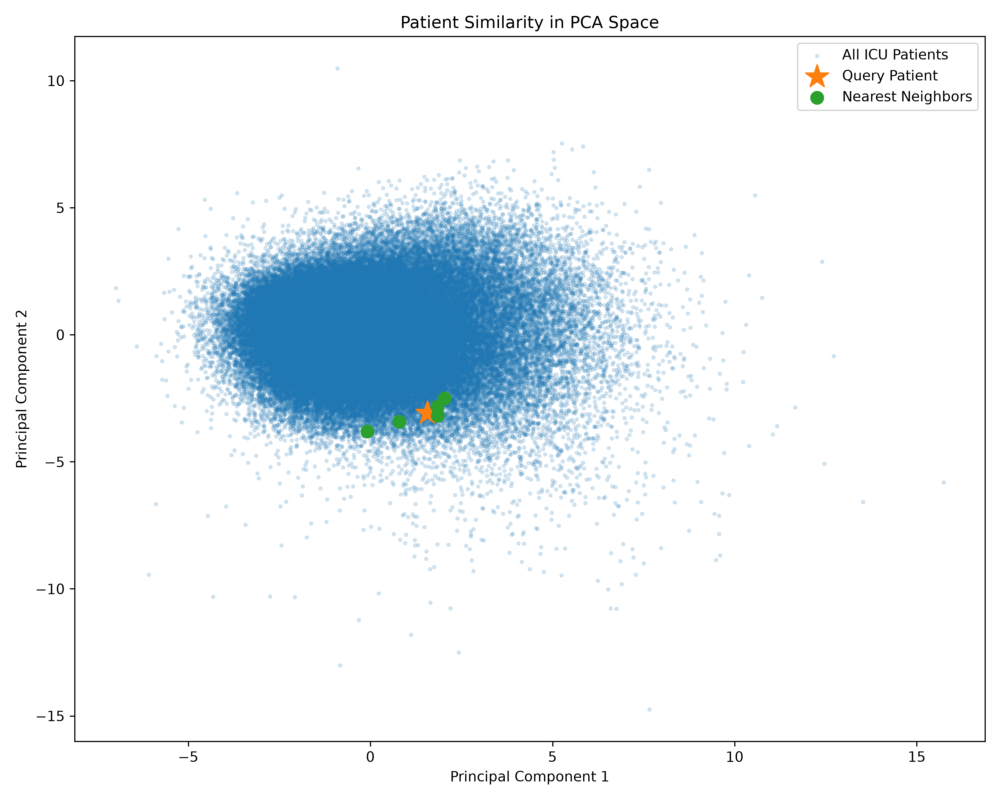
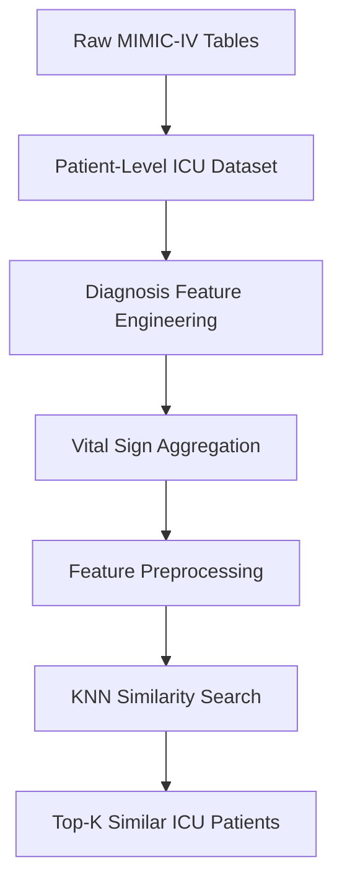

# ICU Patient Similarity Search using MIMIC-IV


AN emd-to-end machine learning pipeline for retrieving clinically similar ICU patients using structured electronic health record (EHR) sata from the MIMIC-IV database. The project includes feature engineering, preprocessing, K-Nearest Neighbors (KNN) similarity search, and PCA visualization.

## Overview

Electronic Health Records (EHRs) contain a large amount of structured clinical information that can be used to identify patients with similar medical characteristics. Finding clinically similar patients can support retrospective research, cohort discovery, clinical decision support, and hypothesis generation.

This project builds end-to-end **patient similarity search engine** using the **MIMIC-IV** critical care database. Each ICU stay is represented by a set of demographic, diagnostic, and physiological features. After preprocessing and feature engineering, a **K-Nearest Neighbors (KNN)** model with **cosine similarity** retrieves patients with the most similar clinical profiles.

The project demonstrates a complete machine learning workflow, including data extraction, feature engineering, preprocessing, similarity search, and visualization.



## Motivation

Healthcare datasets are high-dimensional and heterogeneous, combining patient demographics, diagnoses, laboratory measurements, medications, and vital signs. Rather than predictiong a single outcome, patient similarity search focuses on identifying patients who share comparable clinical characteristics.

Potential applications include:

- Cohort discovery for clinical research
- Clinical decision support
- Case-based reasoning
- Personalized medicine
- Medical educatioin and exploratory analysis

This repository implements the first version of a scalable patient similarity pipeline using structured ICU data.

## Dataset

This project uses the **MIMIMC-IV (Medical Information Mart for Intensive Care IV)** database.

THe current implementation uses:
- Patient demographics
- Hospital admissions
- ICU stays
- ICD diagnosis codes
- Vital sign measurements extracted from **chartevents**
Each row in the final dataset represents a single ICU stay.

## Project Pipeline



## Feature Engineering

Each ICU stay is represented as a patient-level feature vector constructed from structured MIMIC-IV data.

### Demographic Features
- Age
- Gender
- Race
- Admisson
- First ICU care unit

### Diagnosis Features
Binary indicators were created from ICD diagnosis codes for common chronic conditions and acute illness, including:
- Hypertension
- Hyperlipidemia
- Diabetes
- Heart Failure
- Coronary Artery Disease
- Atrial Fibrillation
- Chronic Kidney Injury
- Anemia
- Obesity
- Gastroesophageal Reflux Disease (GERD)
- Urinary Tract Infection (UTI)

### Vital Sign Features
Vital signs were extracted from the **chartevents** table and aggregated at the ICU stay level.
The following summary statistics were computed for each vital sign:
- Mean
- Minimum
- Standard Deviation

Vital signs included:
- Heart Rate
- Respiratory Rate
- Systolic Blood Pressure
- Oxygen Stauration (SpO2)
- Temperature

THe final version 1 feature set contains **37 engineered patient features** before categorical encoding.

## Machine Learning

Patient similarity was computed using a K-Nearest Neighbors (KNN) model with cosine distance.
Before training, the data were preprocessed using a Scikit-learn **ColumnTransformer**.

### Numeric Features
- Missing values imputed using the median
- Standardized using **StandardScaler**

### Categorical Features
- Missing values imputed using the most frequency category
- One-hot encoded un=sing **OneHotEncoder**

After preprocessing, the feature matrix expanded from **37 engineered features** to **94 machine learning features**.

The KNN model was trained using:
- **Algorithm:** K-Nearest Neighbors
- **Distance Metric:** Cosine Distance
- **Neighbors Retrieved:** Top 5 similar ICU patients

## Results

The similarity search successfully identified patients with comparable demographic characteristics, diagnoses, and physiological measurements.

Patients sharing multiple chronic conditions (e.g., hypertension, diabetes, heart failure, and atrial fibrillation) were consistently retrieved as close neighborrs, demonstrating that the engineering features effectively captured clinically meaningful patient similarity.

To visualize the learned feature space, Principal Component Analysis (PCA) was applied to the processed feature matrix.
- Principal Component 1 explained 12.1% of the variance.
- Principal Component 2 explained 8.4% of the variance.
- Together, the first two components explained 20.5% of the total variance.

Although only two dimensions are displayed, the visualization provides an intuitive representation of patient clusters and nearest-neighbor relationships.

### PCA Visualization


### Example Similarity Search

| Rank| Similarity | Age | Gender | ICU Unit | Shared Diagnoses|
|-----|------------|-----|--------|----------|-----------------|
|  1  | 1.00       | 81  | M      | CCU      | HTN, DM, HF     |
|  2  | 0.947      | 82  | M      | CCU      | HTN, DM, HF     |
|  3  | 0.941      | 79  | M      | CCU      | HTN, HF         |
| ... | ...        | ... |...     | ...      | HTN, DM         |

## Repository  Structure

```text
mimic-patient-similarity-search/
│
├── data/
│   ├── raw/
│   └── processed/
│
├── notebooks/
│   ├── 01_build_patient_base.ipynb
│   ├── 02_add_diagnoses.ipynb
│   ├── 03_extract_vitals_duckdb.ipynb
│   ├── 04_add_vitals_labs.ipynb
│   └── 05_similarity_search.ipynb
│
├── figures/
│   ├── patient_similarity_pca.png
│   └── ...
│
├── src/
│
├── README.md
├── requirements.txt
└── LICENSE
```

## How to Run

1. Clone the repository
```git clone https://github.com/<your-username>/mimic-patient-similarity-search.git``` 
```cd mimic-patient-similarity-search```
2. Create a Python environment
```python -m venv venv```

Activate the environment:
macOS/Linux
```source venv/bin/activate```
Windows
```venv\Scripts\activate```
3. Install dependencies
```pip install -r reqiurements.txt```
4. Obtain the MIMIC-IV dataset
This project uses the MIMIC_IV clinical database.
To access the data:
    1. Complete the required training and data use agreement through PhysioNet.
    2. Download the required MIMIC-IV tables.
    3. Place the raw files in the data/raw/ directory.

5. Run the notebooks
Execute the notebooks in order:
    1. 01_build_patient_base.ipynb
    2. 02_add_diagnoses.ipynb
    3. 03_extract_vitals_duckdb.ipynb
    4. 04_add_vitals_labs.ipynb
    5. 05_similarity_search.ipynb
Each notebook builds upon the outputs of the previous notebook.

## Configuration

Create a `.env` file in the project root and define the path to your local MIMIC-IV dataset.
Example:
```env
MIMIC_PATH=/path/to/mimic-iv
```

## Future Work

Planned improvements for Version 2 include:
- Laboratory feature engineering
- Medications features
- Temporal vital-sign trends
- Patient embeddings using deep learning
- Interactive patient similarity dashboard
- Approximate nearest-neighbor search for larger datasets

## Clinical Considerations

This project is intended for educationl and research purposes.

Patient similarity should not be interpreted as a clinical recommendation or decision-support tool. Similarity is computed from structured demographic, diagnosis, and vital-sign features and does not incorporate the full clinical context available to healthcare professionals, including physician notes, imaging, nedicationis, laboratory trends, or treatment history.

## Acknowledgements

This project uses the MIMIC-IV critical care database developed by the MIT Laboratory for Computational Physiology and collaborators.

All patients data are de-identified in accordance with HIPAA Safe Harbor standards.

## License

This repository is released under the MIT License.